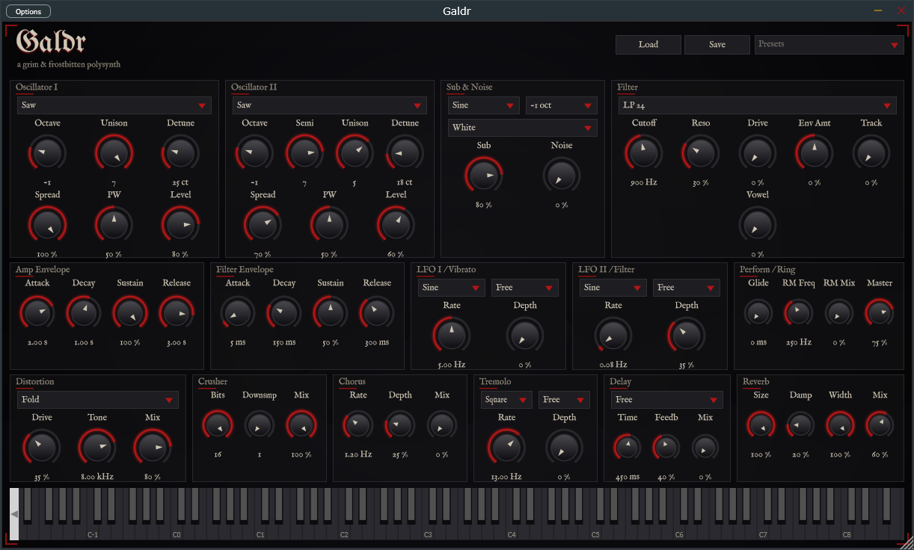

# Galdr

[](https://github.com/andreademurtas/galdr/actions/workflows/build.yml)

*Galdr* (Old Norse for a spell sung rather than spoken) is a free and open-source
synthesizer plugin (VST3, CLAP, AU + standalone) with a black-metal soul, built with [JUCE](https://juce.com).



## Demo

Hear the factory presets, rendered offline straight from the engine by
`tools/RenderDemo.cpp` (no external processing):

[Buzzsaw Wall](https://github.com/andreademurtas/galdr/releases/latest/download/01-buzzsaw-wall.mp3) ·
[Frostbitten Pad](https://github.com/andreademurtas/galdr/releases/latest/download/02-frostbitten-pad.mp3) ·
[Necro Lead](https://github.com/andreademurtas/galdr/releases/latest/download/03-necro-lead.mp3) ·
[Cavern Drone](https://github.com/andreademurtas/galdr/releases/latest/download/04-cavern-drone.mp3) ·
[Winter Sigil](https://github.com/andreademurtas/galdr/releases/latest/download/05-winter-sigil.mp3) ·
[Frozen Choir](https://github.com/andreademurtas/galdr/releases/latest/download/06-frozen-choir.mp3) ·
[Shrieking Gale](https://github.com/andreademurtas/galdr/releases/latest/download/07-shrieking-gale.mp3) ·
[Court of Icicles](https://github.com/andreademurtas/galdr/releases/latest/download/08-court-of-icicles.mp3) ·
[full demo](https://github.com/andreademurtas/galdr/releases/latest/download/galdr-demo-full.mp3)

## Features

- 12-voice engine with poly, mono and legato modes: two band-limited (PolyBLEP)
  oscillators, up to 7-voice unison with detune and stereo spread, sub oscillator
  and white/pink noise
- FM (osc 2 modulates osc 1) and hard sync for aggressive metallic timbres,
  plus per-voice analog drift
- Morphing wavetable mode: 32 mip-mapped frames sweeping from sine through saw
  to an inharmonic "grim" spectrum
- Multimode filter (LP 12/24 dB, HP, BP and vowel formant) with drive, dedicated
  envelope and keytracking
- 8-slot modulation matrix (LFOs, envelopes, velocity, mod wheel, pressure,
  per-note random) routable to pitch, morph, cutoff, FM, FX sends and more,
  with a free third envelope
- Tempo-synced arpeggiator (up/down/up-down/random/as-played, up to 4 octaves)
- Two LFOs, glide, separate amp and filter envelopes
- MPE-friendly per-note pitch bend and pressure; Scala (.scl) microtuning
- Genre FX chain with the nonlinear stages oversampled 2x: four-flavour
  distortion, bitcrusher, ring modulator, chorus, tremolo picking, delay and a
  dark FDN cavern reverb with predelay and octave-up shimmer
- "Blizzard": a granular snowstorm texture layer
- Tempo sync for LFOs, tremolo and delay (musical divisions of the host tempo)
- 27 factory presets in categories (leads, basses, keys and bells, pads and
  choirs, drones, textures, arpeggios) plus user preset save/load, oscilloscope
  and spectrum analyser, on-screen MIDI keyboard
- Dark-fantasy themed GUI, resizable, with tooltips
- VST3, CLAP, AU (macOS) and standalone builds for Windows, macOS and Linux

## Building

Requirements: git, CMake ≥ 3.22 and a C++20 compiler (Visual Studio 2022 on Windows,
Xcode on macOS, GCC or Clang on Linux).

```sh
git clone --recurse-submodules <repo-url>
cd <repo>
cmake -B build
cmake --build build --config Release
```

On Linux, install the JUCE build dependencies first (see the package list in
`.github/workflows/build.yml`).

Artifacts are written to `build/Galdr_artefacts/Release/`:

| Artifact | Install location |
|---|---|
| `VST3/Galdr.vst3` | Windows: `C:\Program Files\Common Files\VST3` · macOS: `~/Library/Audio/Plug-Ins/VST3` · Linux: `~/.vst3` |
| `CLAP/Galdr.clap` | Windows: `C:\Program Files\Common Files\CLAP` · macOS: `~/Library/Audio/Plug-Ins/CLAP` · Linux: `~/.clap` |
| `AU/Galdr.component` | macOS only: `~/Library/Audio/Plug-Ins/Components` |
| `Standalone/` | Run directly, no installation needed |

## License

This project is licensed under the **GNU General Public License v3.0 or later**
(see [LICENSE](LICENSE)).

It uses the [JUCE framework](https://github.com/juce-framework/JUCE), licensed under
the AGPLv3, the VST3 SDK interfaces distributed with JUCE under the MIT license, and
[clap-juce-extensions](https://github.com/free-audio/clap-juce-extensions) (MIT) for
the CLAP export. Binary releases ship the relevant license texts in a `licenses/`
folder plus a `NOTICE.txt` with full attributions.

The GUI embeds the fonts [UnifrakturMaguntia](https://fonts.google.com/specimen/UnifrakturMaguntia)
and [IM Fell English](https://fonts.google.com/specimen/IM+Fell+English), both licensed under the
[SIL Open Font License](assets/fonts/OFL-UnifrakturMaguntia.txt).

*VST is a registered trademark of Steinberg Media Technologies GmbH.*
